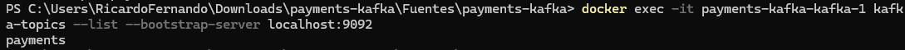
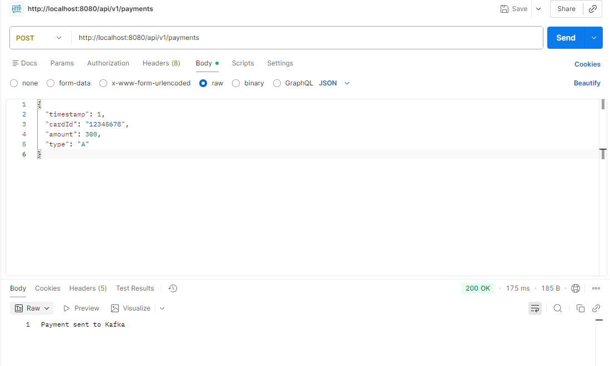
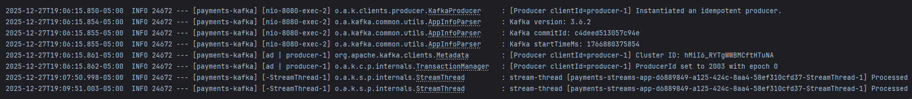
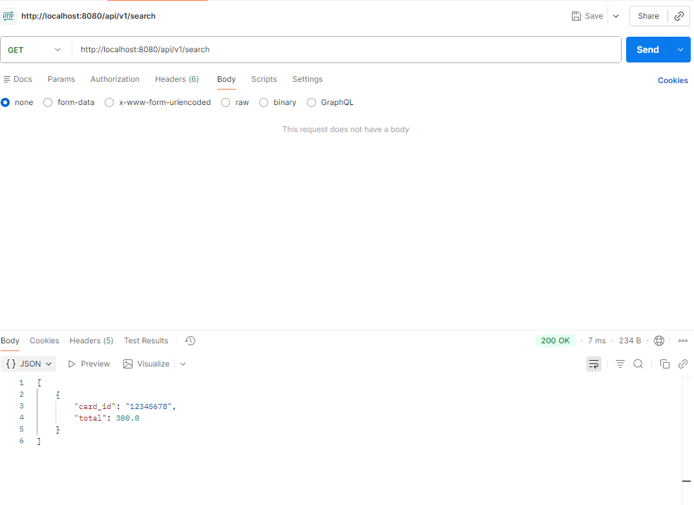

# Evidencias de Funcionamiento

Este documento contiene las evidencias del correcto funcionamiento del sistema.

---

## 1. Contenedores Docker

Se levantaron los servicios de Kafka y Zookeeper mediante Docker.

**Comando ejecutado en powershell:**
docker ps

## 2. Creación del topic

Verificar que el topic existe
**Comando ejecutado en powershell:**
docker exec -it payments-kafka-kafka-1 kafka-topics --list --bootstrap-server localhost:9092

## 3. Registro de Pagos (POST)

Se probó el endpoint de registro de pagos.

Endpoint:

POST /api/v1/payments

Body enviado:

{
  "timestamp": 1,
  "cardId": "12345678",
  "amount": 100,
  "type": "A"
}

Respuesta obtenida:

Payment sent to Kafka

## 4. Procesamiento en Kafka Streams

Los eventos enviados fueron consumidos y agregados por Kafka Streams, actualizando el saldo por tarjeta.

## 5. Consulta de Saldos (GET)

Se probó el endpoint de consulta de saldos.

Endpoint:

GET /api/v1/search

Respuesta obtenida:

[
    {
        "card_id": "12345678",
        "total": 300.0
    }
]

